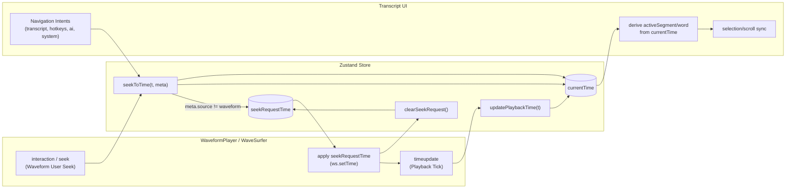
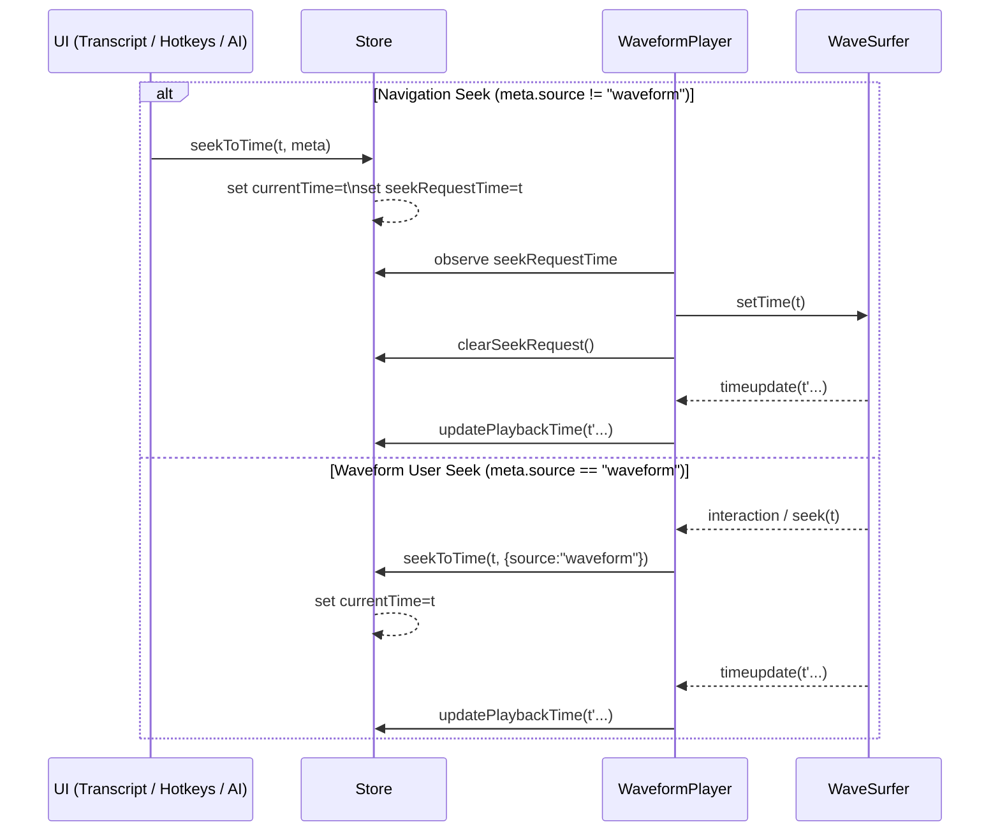

# Player–Transcript Synchronization (Dual-Path Architecture)

## Document Purpose

This document describes the **final architecture** for synchronizing the audio player (waveform / WaveSurfer) with the transcript UI.
It records consciously made decisions, invariants, and failure modes, and serves as a long-term reference for implementation, review, and future changes.

Base document (working draft):
`docs/features/architecture/player-transcript-sync-unified-seek.md`

---

## 1) Architectural Overview

### Problem Space

The application keeps **audio time** and **transcript state** (active segments/words, selection, scroll-follow) consistent while:

* the player continuously emits time values during playback,
* users and features jump discretely to new positions (navigation),
* the waveform itself performs physical seeks (waveform interaction).

### Why There Are Two Fundamental Data Paths

Time moves for two fundamentally different reasons:

1. **Playback Tick (measurement):** observed time position of the audio engine.
2. **Navigation Seek (command / intent):** explicit instruction to jump to a target time.

These paths differ in semantics, frequency, direction, and in whether a return channel to the player is meaningful.
The architecture therefore treats them as **separate data paths with explicit Store APIs**.

### Naming of the Paths

* **Playback Path (“Playback Tick”)**: Player → Store → UI (continuous measurement).
* **Navigation Path (“Navigation Seek”)**: UI / features → Store → Player (discrete command), including the special case **waveform seek**.

### High-Level Diagram



### Time Flow as a Sequence (Navigation vs. Waveform)



---

## 2) Dual-Path Model (Core Concept)

Time synchronization is based on two paths that are **not unified**, because they carry different meanings:

| Property                 | Playback Tick (Measurement)              | Navigation Seek (Command / Intent)                |
| ------------------------ | ---------------------------------------- | ------------------------------------------------- |
| Source                   | Audio engine (`timeupdate`)              | Transcript interaction, hotkeys, AI, system logic |
| Frequency                | high (typically ~60 Hz)                  | low (discrete, user/feature driven)               |
| Direction                | Player → Store → UI                      | UI / logic → Store → Player (+ UI)                |
| Semantics                | “This is where the player is right now.” | “Jump to this time.”                              |
| Return channel to player | no (feedback-loop risk)                  | yes (explicit seek request)                       |

### Why These Paths Must Not Be Unified

A single “everything is seek” semantics would mix measurements and commands.
This creates bidirectional coupling (Store → Player → Store …), encouraging feedback loops, unnecessary Store updates, and timing-dependent race conditions.

The special case **waveform seek** is intentionally *not* a navigation command: the seek has already been executed physically in the player; the Store only mirrors the resulting state.

---

## 3) Store as the Central Semantic Location

### Why the State Store Carries the Semantics

The Store is the only place where both time paths converge.
It carries domain semantics because it:

* defines core concepts (`currentTime`, `seekRequestTime`) centrally,
* models time movement through explicit, typed actions,
* applies validation, clamping, and deduplication consistently,
* enforces seek sources at compile time.

### Central Store Methods

The architecture uses two time actions with distinct meaning:

```ts
updatePlaybackTime(time: number): void
seekToTime(time: number, meta: SeekMeta): void
```

#### `updatePlaybackTime(time)`

* Semantics: observed measurement from the audio engine.
* Effect: updates `currentTime` only.
* No seek request to the player.

#### `seekToTime(time, meta)`

* Semantics: intent to jump to a target time, including the special case `source: "waveform"`.
* Effect: always sets `currentTime` (UI synchrony) and sets `seekRequestTime` only for non-waveform sources.
* Additional behavior: clamping to `[0, duration]` (if available) and deduplication of identical requests.

### Responsibilities (Store vs. Player vs. UI)

* **Store:** models time semantics and emits `seekRequestTime` when a player seek is required.
* **Player:** consumes `seekRequestTime` (executes `ws.setTime(...)`) and clears the request afterward.
* **UI:** derives state from `currentTime` (e.g. active segment/word) and synchronizes selection/scroll as UI effects.

---

## 4) Source Semantics

### Seek Sources (Discriminated Union)

`seekToTime` is only unambiguous if the source (and optionally the trigger) is explicit.
This is enforced via a discriminated union type:

```ts
export type SeekMeta =
  | { source: "waveform" }
  | { source: "transcript"; action: "segment_click" | "word_click" | "controls" }
  | { source: "hotkey"; action: "arrow" | "jump" }
  | { source: "ai"; action: "jump" | "focus" }
  | { source: "system"; action: "restore_session" | "load" | "restrict_playback" };
```

### Why Waveform Seeks Are Special

Waveform seeks differ from navigation seeks: the player has already completed the seek due to direct user interaction.
Issuing an additional seek request would be redundant and prone to feedback loops; therefore `seekRequestTime` is not set when `source: "waveform"`.

### Compile-Time Safety

Modeling seek sources explicitly shifts errors from “hard to reproduce at runtime” to “visible at compile time”.
Seek origins become explicit and can be differentiated in Store logic, tests, and diagnostics.

---

## 5) Architectural Invariants (Explicit)

1. **Playback ticks only modify `currentTime`.**
   `seekRequestTime` remains untouched because a measurement is not a command.
2. **Navigation seeks set `currentTime` synchronously.**
   This keeps the UI deterministic even if the player seeks asynchronously.
3. **`seekRequestTime` is created only from non-waveform sources.**
   Waveform interactions are already executed seeks and require no return channel.
4. **`seekRequestTime` is a request, not a state mirror.**
   It is consumed by the player and then cleared; it does not represent the “true” time.
5. **Seek path and playback path use different Store actions.**
   The semantics remain visible and verifiable in code.
6. **Transcript derivations depend on `currentTime`.**
   Active segment/word highlighting are derived state and never generate seek requests.
7. **Selection sync reacts to time changes regardless of play state.**
   `currentTime` is a valid navigation reference even while paused (e.g. waveform seek).
8. **Gaps map to the next visible segment for selection sync.**
   When `currentTime` falls between segments, the UI selects the next available segment instead of leaving a stale selection.
9. **Clamping happens in the Store.**
   All seeks are normalized to consistent bounds, keeping downstream logic deterministic.
10. **Deleting the selected segment advances selection.**
    When a selected segment is removed and `currentTime` is in a gap, selection advances to the next segment to avoid losing scroll anchoring.

---

## 6) Risks & Failure Modes

### Mixing Paths (Measurement ↔ Command)

If playback ticks are treated as seeks, a return channel to the player emerges.
Typical consequences:

* **Feedback loops:** `timeupdate` → seek request → player seek → `timeupdate` …
* **Race conditions:** UI selection and player position compete via event timing and render load.
* **Performance cascades:** high event frequency + extra Store updates → re-renders → scroll/selection effects → lag.

### Waveform Interaction Producing Seek Requests

If waveform seeks set `seekRequestTime`, a physically completed seek is commanded again.
Symptoms include “snapping back” or “jittering” around the target position, often dependent on buffering and frame timing.

### Why These Issues Are Hard to Debug

The symptoms are timing-sensitive (audio latency, render load, long transcripts, filters) and may disappear under logging or breakpoints (“Heisenbugs”) because event ordering changes.

---

## 7) Non-Goals

This architecture deliberately does not attempt to fully address:

* Undo/redo of time navigation (event sourcing or command history)
* Multi-player or parallel audio sources
* Cross-process or cross-device synchronization (collaborative editing, remote playback)
* Full telemetry / tracing infrastructure for time events beyond source semantics
* Guaranteed sample-accurate correction between transcript timestamps and decoder position beyond clamping/deduplication
